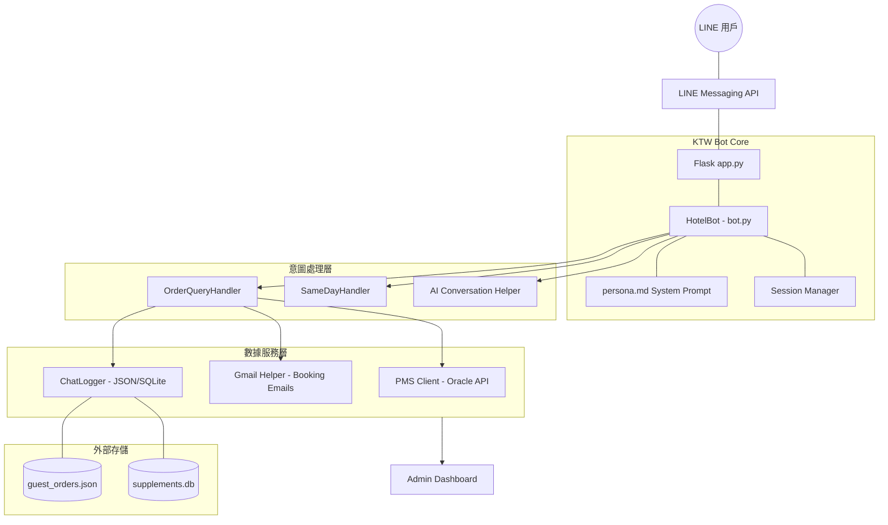

# KTW LINE Bot 核心架構說明書

> **版本**: v1.4.10  
> **最後更新**: 2025-12-19

---

## 1. 核心設計理念 (Philosophy)

KTW LINE Bot 採用 **"System + Function Calling"** 的動態架構。與傳統的死板選單不同，我們利用 AI (Gemini) 的語意理解能力，判斷用戶意圖並調用對應的專業模組。

### 核心原則：
- **意圖導向 (Intent-driven)**：AI 判斷用戶是想查詢、訂房還是聊天。
- **狀態機管理 (Stateful Handling)**：複雜流程（如連續收集電話、時間）由專門的 Handler 負責，確保任務不中斷。
- **雙軌驗證 (Dual Verification)**：結合 PMS API (Oracle) 與 Gmail 備援，確保資料可靠性。

---

## 2. 系統架構圖 (System Architecture)

---

## 3. 模組結構說明 (Module Directory)

### 3.1 核心邏輯層
- **[bot.py](./bot.py)**: 系統進入點。管理 AI 初始化、工具定義與全局意圖路由。
- **[persona.md](./persona.md)**: AI 的「大腦」。定義了服務態度、查詢原則及兩階段確認邏輯。

### 3.2 意圖處理器 (Handlers)
當 AI 判定用戶進入特定任務後，會交由以下 Handler 處理：
- **[order_query_handler.py](./handlers/order_query_handler.py)**: 
    - 負責「3-Step 協議」：驗證 ID → 核對詳情 → 收集需求。
    - 修復了 `KeyError` 並實作了兩階段確認。
- **[same_day_booking.py](./handlers/same_day_booking.py)**: 
    - 處理當日預訂，支援 AI 自動解析多房型字串。

### 3.3 工具與輔助 (Helpers)
- **[pms_client.py](./helpers/pms_client.py)**: 透過 RESTful API 與內網 Oracle 資料庫通訊。
- **[gmail_helper.py](./helpers/gmail_helper.py)**: 在 PMS 離線或查無資料時，掃描飯店信箱作為備援。
- **[google_services.py](./helpers/google_services.py)**: 管理 Google Cloud 授權 (Gemini, Gmail, Drive)。

---

## 4. 數據流動與同步 (Data Sync)

我們遵循 **「Strangler Fig (絞殺榕) 模式」** 進行新舊資料整合：

1. **收集 (Collection)**：Bot 通過對話收集 `phone`、`arrival_time`、`special_requests`。
2. **暫存 (Caching)**：同步寫入 `data/chat_logs/guest_orders.json` (JSON)。
3. **擴充 (Augmentation)**：透過 `update_supplement` API 寫入本地 `supplements.db` (SQLite)。
4. **展現 (Display)**：Admin Dashboard 讀取資料時，以 SQLite 的「Bot 數據」為最高優先權，覆蓋 PMS 的原始資料。

---

## 5. 安全與隱私策略 (Security & Privacy)

- **日期攔截**：嚴格禁止僅憑「日期」查詢訂單。
- **組合驗證**：查詢訂單詳情前，必須驗證「單號 + 姓名」或「單號 + 電話」。
- **敏感欄位遮蔽**：在用戶未完全確認身分前，不顯示具體房號與金額。

---

## 6. 技術棧 (Tech Stack)

- **Language**: Python 3.9+
- **Framework**: Flask (Line Bot SDK)
- **AI Model**: Google Gemini 3.0 Flash Preview
- **Runtime**: PM2 (Process Management)
- **Database**: SQLite (Local Expansion) + Oracle (Legacy Master)

---

*文件自動生成於：2025-12-19*
